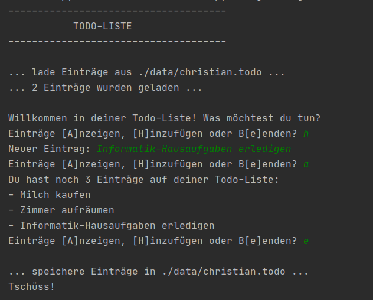

# Projekt 4: Todo-Liste

Versucht, das abgebildete Programm selbst zu bauen. Der **weiße** Text ist die Ausgabe des Programms. Der **grüne** Text wird vom Benutzer eingegeben.

Eine Version ohne Persistenz (dafür aber mit der Bonusaufgabe "Löschen") findet ihr in `program.py`.

## Das könnte dir helfen:

**Listen**

    namen = ['Jule', 'Nils', 'Lena']
    zweiter_namen = namen[1]
    namen.append('Benny')
    # namen -> ['Jule', 'Nils', 'Lena', 'Benny']
    
Es gibt noch viele weitere Methoden wie `.append()` für den Datentyp "Liste". Du findest sie in der [Python-Dokumentation](https://docs.python.org/3/tutorial/datastructures.html).

**Länge**

`len()` gibt die Länge eines Objekts als Ganzzahl zurück:

    lehrer = ['DRI', 'MAT']
    len(lehrer)
    # -> 2

**Docstrings**

Code kann mit einfachen Kommentaren `#`, aber auch gezielt mit einer Dokumentation versehen werden. Für letzteres gibt es die sogenannten Docstrings, die mit drei doppelten Anführungszeichen begonnen und beendet werden. Sie stehen stets am Anfang einer Funktion:

    def nst_berechnen():
        """
        Diese Funktion berechnet die Nullstellen einer mathematischen Funktion.
        """
        # ...hier folgt Code...

**Dateien bearbeiten**

Betriebssysteme (Windows, MacOS, Linux) benutzen unterschiedliche Pfadangaben. Mit der Standard-Bibliothek `os` können diese Pfade unabhängig vom Betriebssystem erstellt werden.

    import os
     
    dateipfad = os.path.abspath('photo.jpg')
    # -> /home/tim/desktop/photo.jpg (Linux) oder 
    # -> C:\Users\Tim\Desktop\photo.jpg (Windows)
   
Um Dateien zu schreiben und zu lesen nehmen wir `open()` und den Kontextmanager `with .. as ..:`

    with open(dateipfad) as datei_in:
        text = datei_gelesen.readlines()
     
    # text -> ['Zeile eins\n', 'Zeile zwei\n', ...]

    with open(dateipfad) as datei_out:
        datei_out.write('Zeile eins\n')

## Bonusaufgabe:

Die Einträge sollen mit einer Deadline versehen werden: `- Geschenke kaufen [18.12.2020]`
